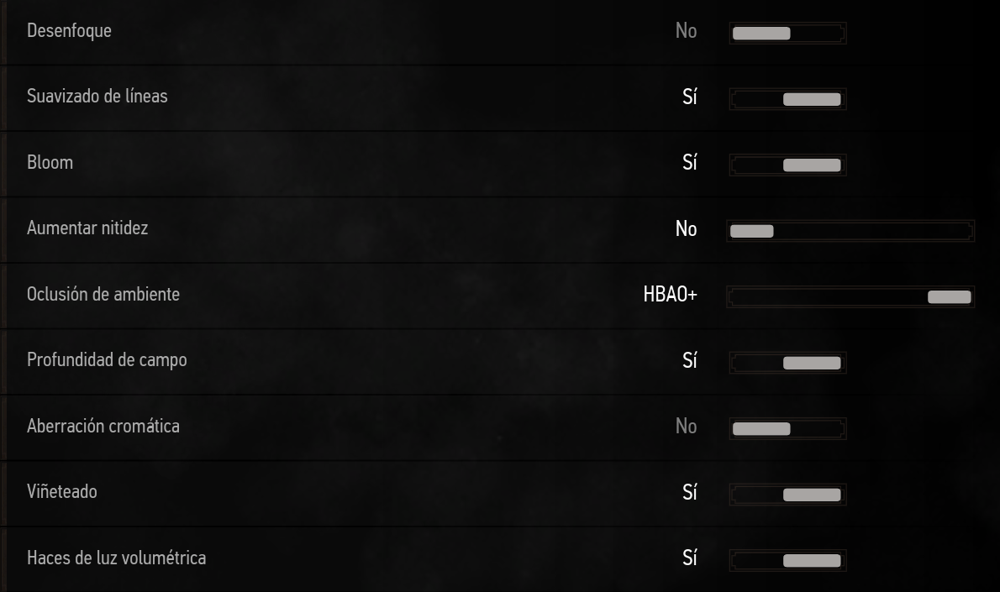
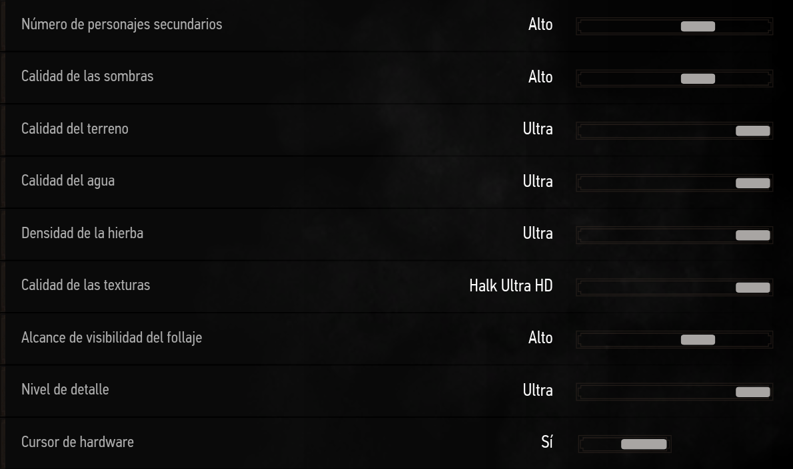

# Para todos los juegos
## Gráficos
- Asegúrate que tu monitor esté a la máxima frecuencia de refresco (144Hz o lo que corresponda)
  - Si tu monitor es compatible con Freesync, habilitalo (el panel de NVIDA mostrará G-Sync compatible o similar)
- [Filtrado Anisotrópico](https://www.pcgamingwiki.com/wiki/Glossary:Anisotropic_filtering_(AF)) = x16 / Máx
- Motion Blur... *no*
  
## Controles
- Entrada directa de ratón = On
  - Combinar en Windows con "Mejorar la precisión del puntero = Off"
     - Configuración del mouse > (izq) Opciones adicionales > Opciones de puntero
- Suavizado de ratón = Off
  - Cualquier opción de mejorar precisión = Off

# Ajustes específicos por juegos
- Varios grupos de ajustes por [Hardware Unboxed](https://www.youtube.com/playlist?list=PL7m5C6_P_lnXQhO8YRLfVVMSGo0UwDIne) [EN]
- Varios grupos de ajustes por [Gamers Nexus](https://www.youtube.com/results?search_query=gamers+nexus+optimizations+guide) [EN]
- Si un ajuste no aparece, da igual o no se sabe la mejor opción
- Si aparecen varias opciones, normalmente indican misma relación calidad-rendimiento, por orden de recomendado

### Assetto Corsa

 Mods básicos, por no decir necesarios. No incluye pistas o coches 

  
+ Mods
  + [Content Manager + Custom Shader Patch](https://assettocorsa.club/content-manager.html)
  + [Sol](https://www.racedepartment.com/downloads/sol.24914/)
  + Recomendado pero menos importantes, ponen AC al día
    + [Fonsecker's Sound Mod](https://www.racedepartment.com/downloads/authors/fonsecker.213905/) (4 partes)
    + [IMrlMike's Miscellaneous Sound Pack](https://www.racedepartment.com/downloads/custom-miscellaneous-sound-pack-by-imrimike.23336/)
    + [Clean Menu UI](https://www.racedepartment.com/downloads/clean-menu-ui-graphic-elements.16484/)
    + [Replay Icons Overhaul](https://www.racedepartment.com/downloads/replay-icons-overhaul.34940/)
    + [Immersive Pit Marker](https://www.racedepartment.com/downloads/immersive-pit-marker-ipm.38069/)
    + [Mejor Traducción](https://www.racedepartment.com/downloads/mejor-traducción-al-español.34022/)

### Cyberpunk 2077
 - [Gamers Nexus Settings](https://www.youtube.com/watch?v=TEVXVf4Hu0U) [EN]

### Forza Horizon 4

 Esto son ajustes para una buena relación de rendimiento-calidad, basado en <a href="https://www.youtube.com/watch?v=Z8UODAGyOJs">Hardware Unboxed</a> 

+ Night Shadows = Sí
+ Shadow Quality = Extremo / Ultra
+ Texture Quality = Ultra [Limitado por VRAM, 4GB @ 1080p suficiente]
+ Dynamic Geometry Quality = Medio
+ Antialiasing = x2 MSAA
+ FXAA Antialias = A gusto
+ SSAO = Ultra
+ Refletion Quality = Ultra / Alto
+ Windshield Reflection Quality = Ultra
+ Mirror Quality = Extremo
+ World Car LoD = Ultra / Alto [Difs notables en calidad y rendimiento]
+ Deformable Terrain Quality = Ultra
+ SSR = Alto / Medio
+ Lens Effect = No / Medio (por gusto)
+ Shader Quality = Alto
+ Particle Effects = Alto (bajar si CPU mal)

### The Witcher 3 (anterior al remaster prometido para Next-Gen)

 Ajustes basados en <a href="https://www.gamersnexus.net/game-bench/1952-complete-witcher-3-graphics-optimization-guide-and-performance">Gamers Nexus</a>. Mods disponibles en <a href="https://www.nexusmods.com/witcher3">Nexus Mods</a>. Gamers Nexus y Nexus Mods no están relacionados 

+ Mods
  + [The Witcher 3 HD Reworked Project](https://www.nexusmods.com/witcher3/mods/1021)
  + [Phoenix Lighting](https://www.nexusmods.com/witcher3/mods/3170)
+ Ajustes
  + Post Procesado
  
    + Desenfoque de movimiento = No afecta al rendimiento
    + Suavizado de líneas = Sí
    + Bloom = Sí
    + Aumentar nitidez = No afecta al rendimiento
    + Oclusión ambiental = HBAO + / SSAO (Puede rendir mejor con AMD) / Off (Si nada de potencia)
    + Profundidad de campo = Sí (Solo afecta cinemáticas)
    + Aberración Cromática = No (No afecta al rendimento, efecto de cámara, no ojo)
    + Viñeteado = No afecta al rendimiento
  + Gráficos
  
    + Nvidia Hairwoks = No
    + Número de personajes secundarios = No afecta al rendimiento
    + Calidad de las sombras = High / Medium
    + Calidad del terreno = Ultra [Depende de CPU]
    + Calidad del agua = Ultra
    + Densidad de la hierba =  Ultra
    + Calidad de texturas = Halk Ultra HD (Requiere TW3 HD Reworked Project, Ver "Mods") / Ultra
    + Alcance de visibildad del follaje = Alto / Medio
    + Nivel de detalle = Ultra

