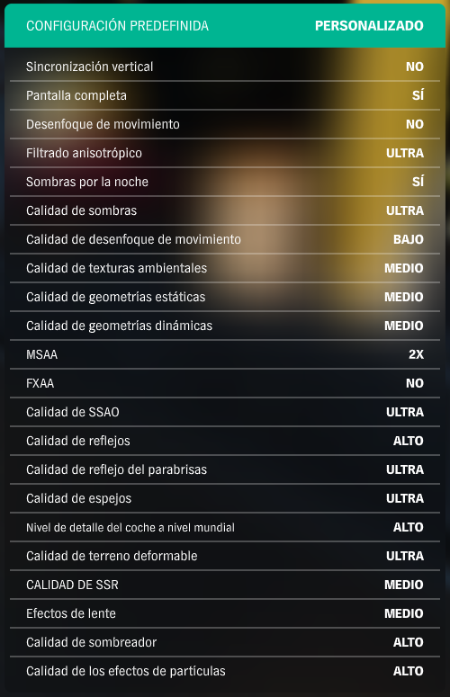

# Para todos los juegos
## Gráficos
- Asegúrate que tu monitor esté a la máxima frecuencia de refresco (144Hz o lo que corresponda)
  - Si tu monitor es compatible con Freesync, habilitalo (el panel de NVIDA mostrará G-Sync o similar)
- [Filtrado Anisotrópico](https://www.pcgamingwiki.com/wiki/Glossary:Anisotropic_filtering_(AF)) = x16 / Máx
  - Se puede forzar NVIDIA Control Panel y AMD equivalente para todos los juegos
- Motion Blur... *no*
  
## Controles
- Entrada directa de ratón = On
  - Combinar en Windows con "Mejorar la precisión del puntero = Off"
     - Configuración del mouse > (izq) Opciones adicionales > Opciones de puntero
- Suavizado de ratón = Off
  - Cualquier opción de mejorar precisión = Off

# Ajustes específicos por juegos
- Varios grupos de ajustes por [Hardware Unboxed](https://www.youtube.com/playlist?list=PL7m5C6_P_lnXQhO8YRLfVVMSGo0UwDIne) [EN]
- Varios grupos de ajustes por [Gamers Nexus](https://www.youtube.com/results?search_query=gamers+nexus+optimizations+guide) [EN]
- Si un ajuste no aparece, da igual o no se sabe la mejor opción
- Si aparecen varias opciones, normalmente indican misma relación calidad-rendimiento, por orden de recomendado

### Forza Horizon 4

 Esto son ajustes para una buena relación de rendimiento-calidad, basado en <a href="https://www.youtube.com/watch?v=Z8UODAGyOJs">Hardware Unboxed</a> 

+ Night Shadows = On </ul>
+ Shadow Quality = Extreme / Ultra </ul>
+ Texture Quality = Ultra [Limitado por VRAM, 4GB @ 1080p suficiente] </ul>
+ Dynamic Geometry Quality = Medio </ul>
<ul> Antialiasing = x2 MSAA </ul>
<ul> FXAA Antialias = A gusto </ul>
<ul> SSAO = Ultra </ul>
<ul> Refletion Quality = Ultra / High </ul>
<ul> Windshield Reflection Quality = Ultra </ul>
<ul> Mirror Quality = Extreme </ul>
<ul> World Car LoD = Ultra / High [Difs notables en calidad y rendimiento] </ul>
<ul> Deformable Terrain Quality = Ultra </ul>
<ul> SSR = High / Med </ul>
<ul> Lens Effect = Off / Med (por gusto) </ul>
<ul> Shader Quality = High </ul>
<ul> Particle Effects = High (bajar si CPU mal) </ul>

### Cyberpunk 2077
 - [Gamers Nexus Settings](https://www.youtube.com/watch?v=TEVXVf4Hu0U) [EN]
